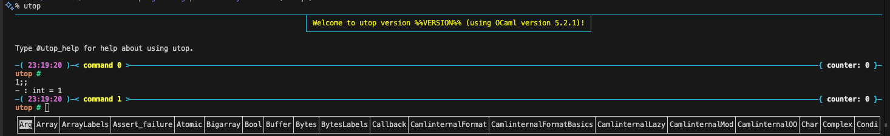

# programming-fundamentals-published-by-science-company
サポートページ: http://pllab.is.ocha.ac.jp/~asai/book/Top.html

## （旧）実行
```sh
ocaml
>#use "ファイル名.ml";;
```

2024年12月、公式の対話型インストールしてみたらすごいかっこよくなっていた。。


## 起動
```sh
utop
```

## 実行
実行自体はこれで十分
```sh
% ocaml hello.ml
Hello, World!
```

ocaml コマンドが使えなくなった時、以下を打つと良いかも
```sh
eval $(opam env)
```

## デザインレシピまとめ
デザインレシピの決定版自体は、本の82ページに存在する。より詳細はそちらへ
```
データ定義
入出力の型を考え、構造を持つなら type で定義
↓
目的
↓
例
green, red のテストを書く
再起的なデータの場合、簡単に出るケースと再帰で求めるケースを絶対に全て書く（リストの場合は[]か残りのリストになる）
↓
テンプレート
【配列の再帰例】
入力（の一部）が構造データなら、match 文を作る
入力データの型が決まると、大枠は自然に定まる
or
【一般の再帰例】
if (* 自明に答えが出るケースの条件 *)
    then  (* 自明に答えが出るケース *)
    else  (* それ以外のケース *)
→この時、結果的に match 文にできる時は match 文にする
    →こうすると、自明に答えが出ないケースで first :: rest といったパターン変数をつけるので便利。
↓
条件分岐がある場合、一旦適当な値を返す if 文を作る
↓
本体
再帰関数の場合、rec をつける
↓
テスト
```
